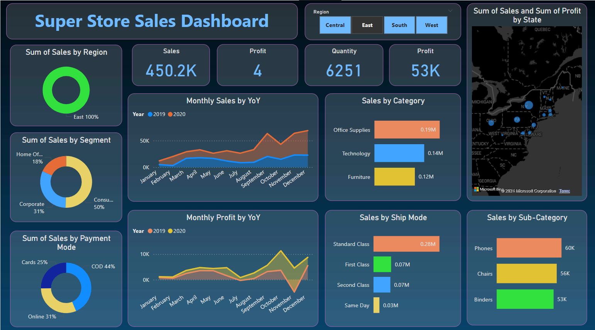
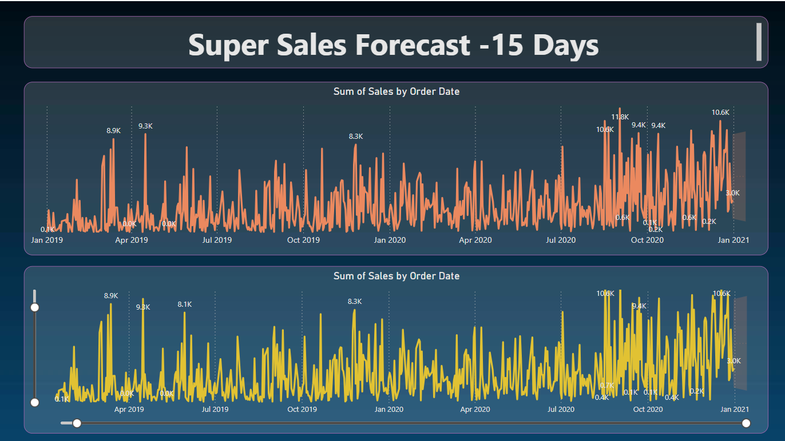

# E-commerce Sales Dashboard

This dashboard provides a comprehensive overview of online sales performance, allowing for data-driven decision making.

## Key Performance Indicators:

### Total revenue
Sales by product category
Customer acquisition cost
Customer lifetime value
Churn rate

### Technologies Used:
Tableau
Excel

### Data Sources:
E-commerce database
Google Analytics

### Dashboard Features:
Interactive bar charts, line charts, and pie charts
Geographic maps for sales by region
Time-series analysis for sales trends
Filtering by product, customer, and time period
